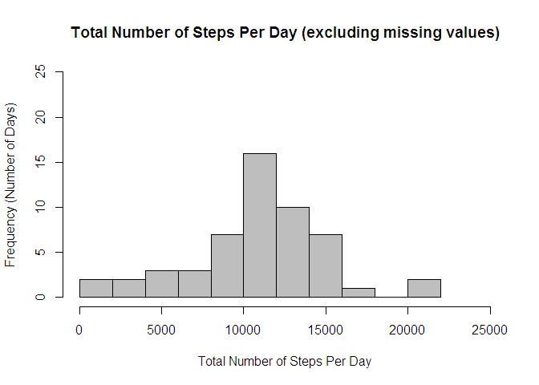
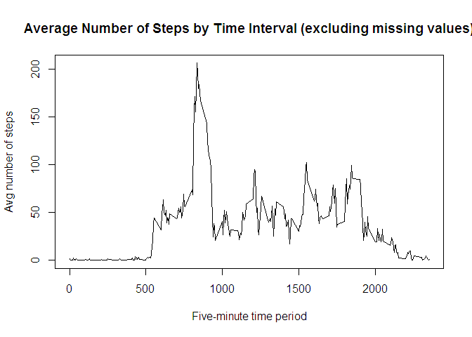
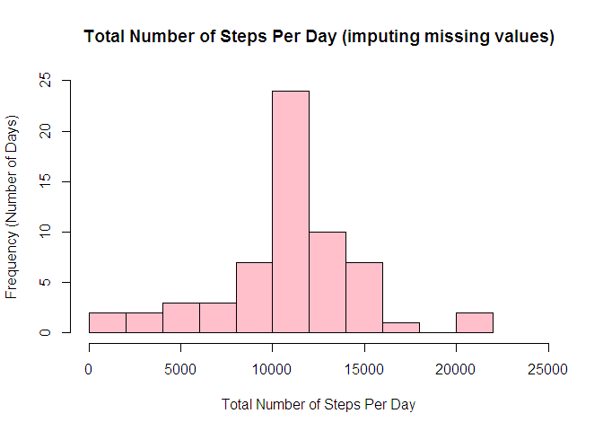
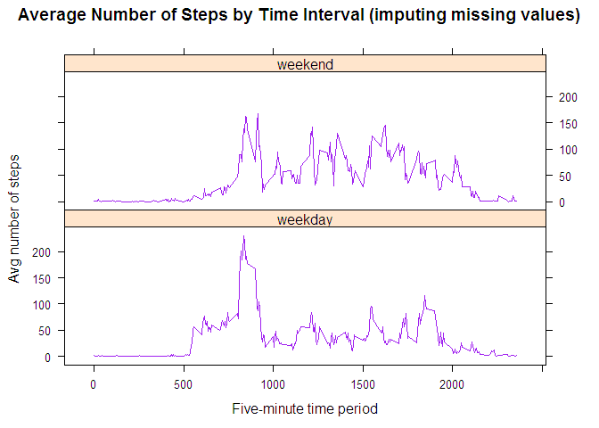

# Reproducible Research: Peer Assessment 1


## Loading and preprocessing the data

```r
library(lattice)
library(knitr)
setwd("D:/MIT/activity/")
wm <- as.data.frame(read.csv(file = "activity.csv", header = TRUE))
```

```r
min_date <- min(as.Date(wm$date))
max_date <- max(as.Date(wm$date))
ttl_days <- as.numeric(max_date - min_date) + 1
wm_no_NA <- wm[complete.cases(wm), ]
numb_of_NAs <- nrow(wm) - nrow(wm_no_NA)
```


## What is mean total number of steps taken per day?


```r
ttl_stps_day <- as.data.frame(tapply(wm_no_NA$steps, INDEX = wm_no_NA$date, 
    FUN = "sum", na.rm = TRUE))
colnames(ttl_stps_day) <- "steps"
ttl_stps_day$date <- as.Date(rownames(ttl_stps_day))
ttl_stps_day$steps <- as.integer(ttl_stps_day$steps)
```

```r
mean_no_NA <- mean(ttl_stps_day$steps, na.rm = TRUE)
median_no_NA <- median(ttl_stps_day$steps, na.rm = TRUE)
```

```r
hist(ttl_stps_day$steps, main = "Total Number of Steps Per Day (excluding missing values)", 
    xlab = "Total Number of Steps Per Day", ylab = "Frequency (Number of Days)", 
    breaks = 10, xlim = c(0, 25000), ylim = c(0, 25), col = "grey")
```

 
## The Mean is 

```r
mean_no_NA
```

```
## [1] 10766.19
```

```r
median_no_NA 
```

```
## [1] 10765
```

## What is the average daily activity pattern?


```r
mean_stps_per_intvl <- as.data.frame(tapply(wm_no_NA$steps, INDEX = wm_no_NA$interval, 
    FUN = "mean", na.rm = TRUE))
colnames(mean_stps_per_intvl) <- "avg_steps"
mean_stps_per_intvl$interval <- rownames(mean_stps_per_intvl)
is_max <- (mean_stps_per_intvl$avg_steps == max(mean_stps_per_intvl$avg_steps))
max_mean_stps_per_intvl <- mean_stps_per_intvl[is_max, ]

max_interval <- max_mean_stps_per_intvl[1, 2]
plot(mean_stps_per_intvl$interval, mean_stps_per_intvl$avg_steps, type = "l", 
    xlab = "Five-minute time period", ylab = "Avg number of steps", main = "Average Number of Steps by Time Interval (excluding missing values)")
```

 

```r
max_interval
```

```
## [1] "835"
```


## Imputing missing values


```r
fill_in_NAs <- (merge(mean_stps_per_intvl, wm, by = "interval"))
sort_order <- order(fill_in_NAs$date, as.numeric(fill_in_NAs$interval))
fill_in_NAs <- fill_in_NAs[sort_order, ]

for (i in (1:nrow(fill_in_NAs))) {
    if (is.na(fill_in_NAs$steps[i])) {
        fill_in_NAs$steps_no_NAs[i] <- fill_in_NAs$avg_steps[i]
    } else {
        fill_in_NAs$steps_no_NAs[i] <- fill_in_NAs$steps[i]
    }
}
```

```r
ttl_stps_day_imput <- as.data.frame(tapply(fill_in_NAs$steps_no_NAs, INDEX = fill_in_NAs$date, 
    FUN = "sum", na.rm = TRUE))
colnames(ttl_stps_day_imput) <- "steps"
ttl_stps_day_imput$date <- as.Date(rownames(ttl_stps_day_imput))
ttl_stps_day_imput$steps <- as.integer(ttl_stps_day_imput$steps)
```

```r
mean_impute <- mean(ttl_stps_day_imput$steps, na.rm = TRUE)
median_impute <- median(ttl_stps_day_imput$steps, na.rm = TRUE)
```

```r
hist(ttl_stps_day_imput$steps, main = "Total Number of Steps Per Day (imputing missing values)", 
    xlab = "Total Number of Steps Per Day", ylab = "Frequency (Number of Days)", 
    breaks = 10, xlim = c(0, 25000), ylim = c(0, 25), col = "pink")
```

 


## Are there differences in activity patterns between weekdays and weekends?

```r
weekend_log <- grepl("^[Ss]", weekdays(as.Date(fill_in_NAs$date)))

for (i in (1:nrow(fill_in_NAs))) {
    if (weekend_log[i] == TRUE) {
        fill_in_NAs$day_of_week[i] <- "weekend"
    } else {
        fill_in_NAs$day_of_week[i] <- "weekday"
    }
}
```

```r
mean_stps_per_intvl_imput <- aggregate(fill_in_NAs$steps_no_NAs, by = list(fill_in_NAs$interval, 
    fill_in_NAs$day_of_week), FUN = "mean", na.rm = TRUE)
colnames(mean_stps_per_intvl_imput) <- c("interval", "weekday_weekend", "avg_steps")

sort_order <- order(as.numeric(mean_stps_per_intvl_imput$interval))
mean_stps_per_intvl_imput <- mean_stps_per_intvl_imput[sort_order, ]
```

```r
mean_by_day_type <- aggregate(fill_in_NAs$steps_no_NAs, by = list(fill_in_NAs$day_of_week), 
    FUN = "mean", na.rm = TRUE)
mean_weekdays <- round(mean_by_day_type[1, 2], 2)
mean_weekends <- round(mean_by_day_type[2, 2], 2)
```

```r
xyplot(avg_steps ~ as.numeric(interval) | as.factor(weekday_weekend), data = mean_stps_per_intvl_imput, 
    type = "l", layout = c(1, 2), col = c("purple"), main = "Average Number of Steps by Time Interval (imputing missing values)", 
    xlab = "Five-minute time period", ylab = "Avg number of steps")
```

 

